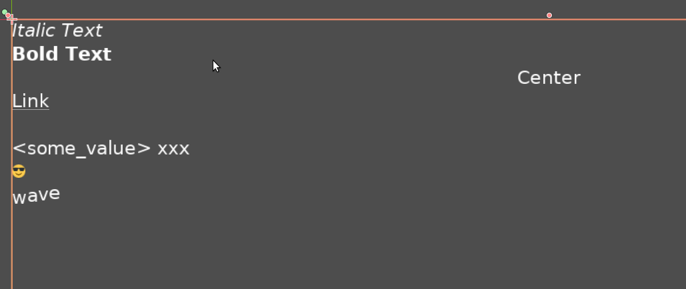

# Other News

## Godot 3.3 Release

This release of Godot is very important for Rakugo because one of changes.
This important change is that now it supports custom threads in HTML5 export.
That finally fixes Rakugo HTML5 export, because Rakugo **Dialog** node uses custom threads.
[I already wrote article about it in our Docs](https://rakugodocs.readthedocs.io/en/latest/topics/export/)

## Vaasref Leaves the Teams

Me and Vaasref had a very different approach to the project and its further development.
The collaboration is not going well for us.
After long discussions we decided that each of us would go our own way in the best possible way.
[He currently has his own similar project, more info here](https://github.com/Vaasref/Agartha)

# This Release

## New big Node: RakugoTextLabel

I was planning to add better support animation, but I have to make some big changes in the project to do that.
But it turned out that because of our poor communication only `say ()` and its gui,
contrary to what the documentation says, supported markups in **3.1.x**.
This release also focused on fixing this problem. For this purpose, I created a new node.

**RakugoTextLabel** Node that allows to use `renpy`, `markdown` or `bbcode` in gui.
It also works in edit mode, but in that mode it will not replace Rakugo vars with its values.


Now `menu()` in-game gui supports it and also multiple lines using `\n`.


Now also `notify()` in-game gui supports it.


## Simpler use of `menu()`

It this release I made use of `menu()` simpler:

- `menu()` can now use shorten choice arrays for example `["First choice", 1]` instead of `["First choice", 1, {}]`
- `menu()` can now use array of just strings in this case it will return label as choice

Both ways can be used.

### Here is new `menu()`:

```python
var test = menu([
  "Just string can be a choice",
  ["Choice can be one size"],
  ["This choice returns 2", 2],
])
```

### Here is old `menu()`:

How menu above would look like in old way

```python
var test = menu([
  ["Just string can be a choice", "Just string can be a choice", {}]
  ["Choice can be one size", "Choice can be one size", {}],
  ["This choice returns 2", 2, {}],
])
```

## Breaks

Using new **RakugoTextLabel** by in-game gui, breaks in-game gui from _3.1_.

## Changes

- remove `simple_markdown` markup from project
- new **RakugoTextLabel** Node that allows to use `renpy`, `markdown` or `bbcode` in gui
- remade menu, dialogue, `notify()` gui to use it.
- gui menu now supports `\n` (multiple lines) in choice labels
- `menu()` can now use shorten choice arrays for example `["First choice", 1]` instead of `["First choice", 1, {}]`
- `menu()` can now use array of just strings in this case it will return label as choice
- Multiple dialog display styles support out of the box - no longer is needed setup as was described in docs for `3.1`
- Use consts to get project settings instead of string when it can be

## Update

Just unpack _Rakugo_3.2_update.zip_ to overwrite your Rakugo 3.1 project.

## Download

[Download Here](https://github.com/rakugoteam/Rakugo/releases/tag/3.2.0)
